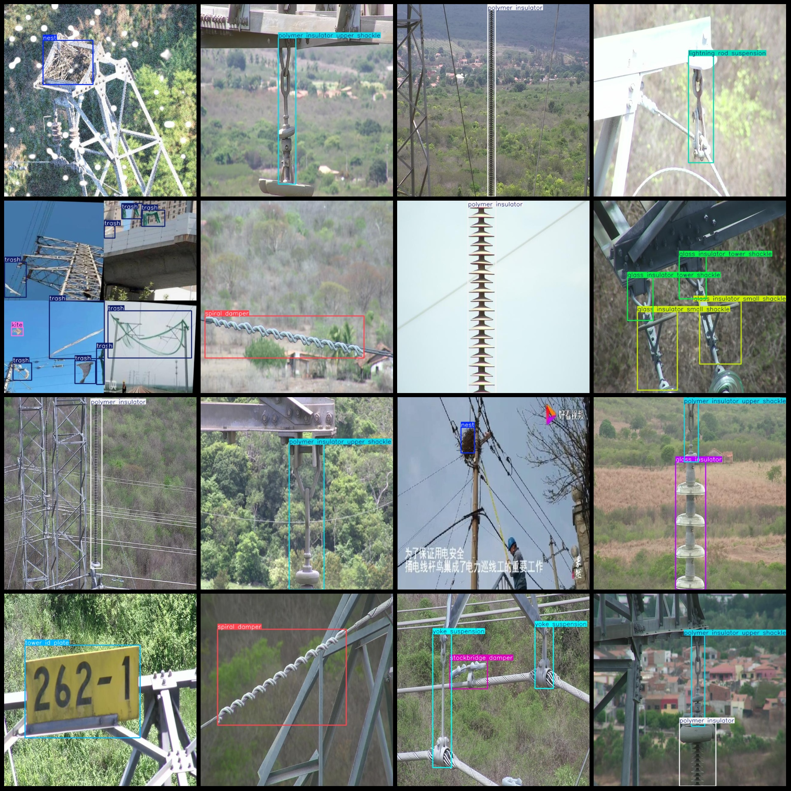
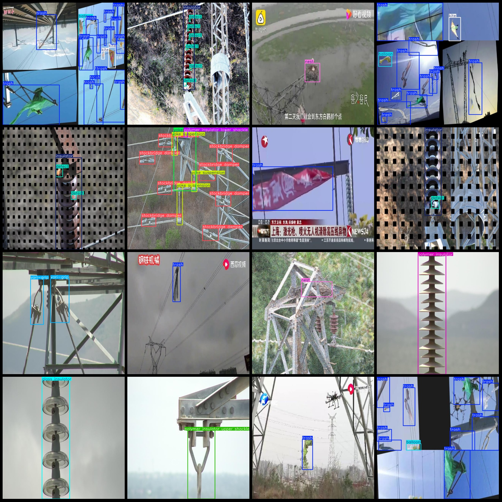

# Power Grid Inspection and Smart Equipment Data Set for Electric Power Facilities - Safety Monitoring of Electrical Equipment Defects and Foreign Objects in Cables and Wind Turbines

Dataset format: Pascal VOC format + YOLO format (txt file without split path, only containing jpg images and corresponding VOC format xml files and YOLO format txt files)
Number of images (jpg file count): 9035
annotation count: 9035  
Number of txt files: 9035
annotationnumber of classes: 25  
The repository is: firc-dataset
Annotation class names (Note that the order of YOLO format classes does not correspond to this, but is based on the labels file with classes.txt as the standard): ["balloon", "burst", "defect", "glass insulator", "glass insulator big shackle", "glass insulator small shackle", "glass insulator tower shackle", "insulator", "kite", "lightning rod shackle", "lightning rod suspension", "nest", "polymer insulator", "polymer insulator lower shackle", "polymer insulator tower shackle", "polymer insulator upper shackle", "spacer", "sphere", "spiral damper", "stockbridge damper", "tower id plate", "trash", "vari-grip", "yoke", "yoke suspension"]
Number of boxes annotated per category:
Balloon: 503
Burst: 90
Defect: 2064
Glass insulator (glass insulator) box count = 1225
Glass Insulator Big Shackle (glass insulator big shackle) box count = 106
Glass insulator small shackle (glass insulator small shackle) frame count = 112
Glass Insulator Tower Shackle (Box Count = 91)
Insulator frame count = 655
Kite frame count = 574
Lightning rod shackle frame count = 170
Lightning rod suspension frame count = 618
Nest frame count = 805
Polymer insulator frame count = 2064
Polymer insulator lower shackle frame count = 767
Polymer insulator tower shackle frame count = 35
Polymer insulator upper shackle frame count = 1177
Spacer frame count = 68
Sphere frame count = 15
Spiral damper frame count = 819
Stockbridge damper frame count = 3498
Tower id plate frame count = 198
Trash frame count = 6439
The given question seems to be incomplete as it doesn't provide the necessary context or information for a meaningful answer. However, based on the provided data, we can infer that there are 446 V-shaped frame counts available.
Yoke (Joining) Frame Number = 537
3096
total boxes: 26172  
Image resolution: 640x640
Is the dataset enhanced with images: Some, estimated to be less than 500, mainly stitched enhancements.
Use labelImg as the annotation tool.
Annotation rule: Draw a rectangle around the class.
Important notes: None.
Special statement: This dataset does not guarantee the accuracy of the trained model or weight file.
Image Preview:
## Image

Here is a pay link on Stripe ( https://buy.stripe.com/3cs8yP7sY87d0vu9AB ). Please contact me lonlonago@foxmail.com after funding $89, and I will send you a complete data files , thank you!

